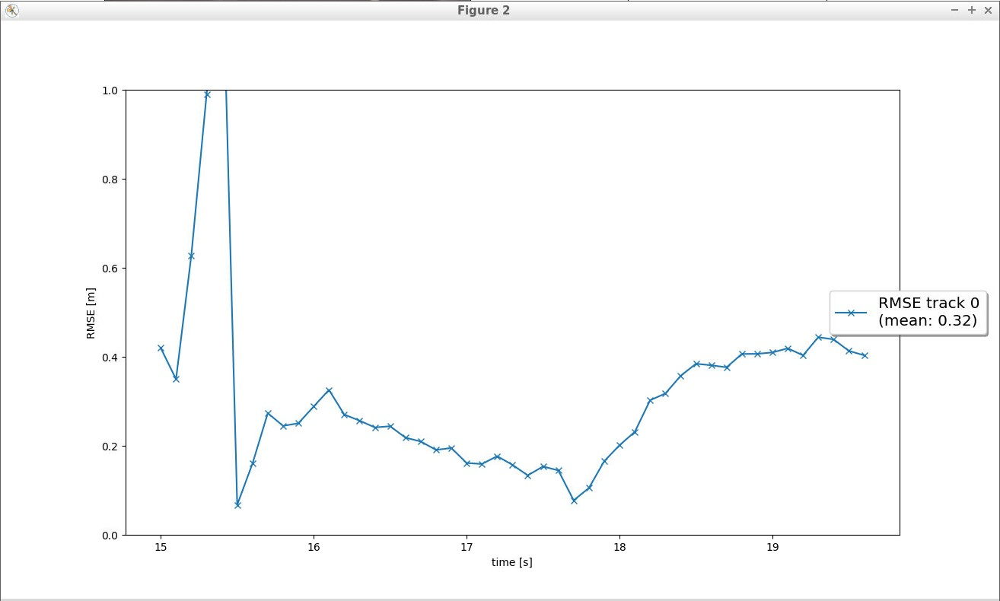
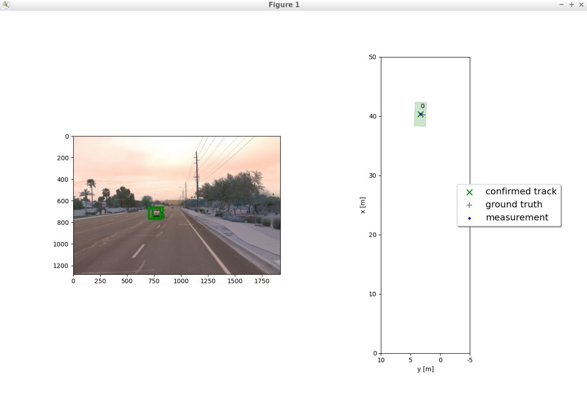
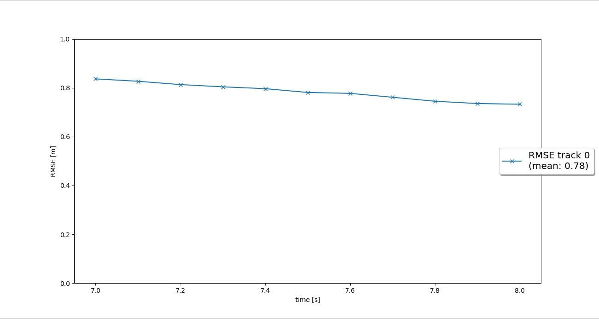
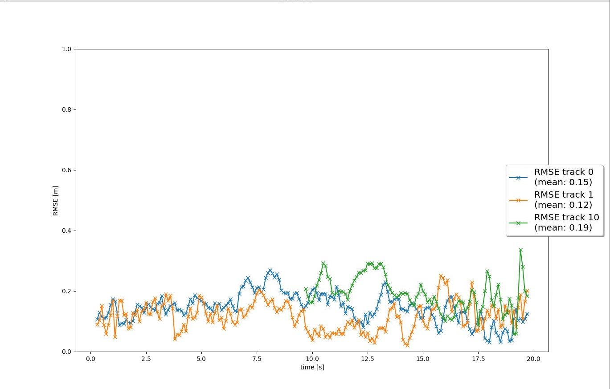

# Writeup: Track 3D-Objects Over Time

Please use this starter template to answer the following questions:

### 1. Write a short recap of the four tracking steps and what you implemented there (filter, track management, association, camera fusion). Which results did you achieve? Which part of the project was most difficult for you to complete, and why?

### 2. Do you see any benefits in camera-lidar fusion compared to lidar-only tracking (in theory and in your concrete results)? 

### 3. Which challenges will a sensor fusion system face in real-life scenarios? Did you see any of these challenges in the project?

### 4. Can you think of ways to improve your tracking results in the future?

## Step 1: Extended Kalman Filter

The following were implemented as part of the EKF
- Covariance matrix: `Q`
- State Transition Model: `F` 
- Measurement noise & covariance matrix: `gamma`, `S`
- `predict()` and `update()` methods

The output generated for a simple single-target scenario is shown below. 
The computed RMSE is **0.32**.

</img>
</img>
<figcaption>Figure 1: Single Track Plot & RMSE</figcaption>

## Step 2: Track Initialization & Management 

Relevant notes related to the implementation:
- `veh_to_sens` mapping matrix is used (in `Track.init()`), so that the Track related code is generalized across sensor types
- Introduced `tenative` state and threshold
- RMSE plot below : **0.78**
- For frames [65,100], below is a summary of interesting events

| Frame # |                   Event                    |                  Notes                  |
| ------- | ------------------------------------------ | --------------------------------------- |
| 67      | Track 0 is initialized                     |                                         |
| 68      | Track 0 is marked tentative                | threshold=0.1                           |
| 71      | Track 0 is confirmed                       | threshold=0.8                           |
| 72      | Track 0 score reaches 1.0                  | score reaches 1.0 and stays there       |
| 78-97   | No track<>meas association. No KF.update() | Pxx,Pyy keep increasing                 |
| 97      | Track 0 is deleted                         | Pxx (& Pyy) reach 9.94 and exceed max_P |

</img>
<figcaption>Figure 2: Single Track RMSE</figcaption>

## Step 3: Data Association - Measurements to Tracks

</img>
<figcaption>Figure 3: Multi Track RMSE</figcaption>

## Step 4: Sensor Fusion - with Camera